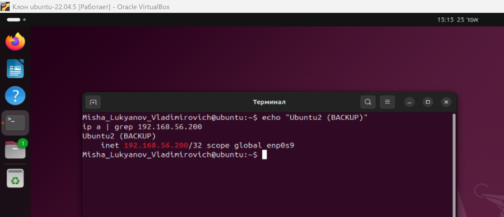

# Домашнее задание к занятию "`Disaster recovery и Keepalived`" - `Лукьянов Михаил

# Домашнее задание 1 — HSRP

## Цель
Настроить отказоустойчивость сети с использованием HSRP.

---
## Настройка


---

## Проверка состояния HSRP

Router0:


Router1:


---

## Проверка отказоустойчивости


---

## Вывод

HSRP настроен успешно.  
При отказе активного маршрутизатора происходит переключение на резервный с минимальной потерей пакетов.


# Домашнее задание 2 — Keepalived

## Цель

Настроить отказоустойчивость сервиса с использованием keepalived и виртуального IP.

---

## Описание стенда

* Ubuntu1 — 192.168.56.101 (MASTER)
* Ubuntu2 — 192.168.56.104 (BACKUP)
* Виртуальный IP — 192.168.56.200

---

## Установка

```bash
sudo apt update
sudo apt install nginx -y
sudo apt install keepalived -y
```

---

## Конфигурация keepalived

### Ubuntu1 (MASTER)

```bash
vrrp_script chk_nginx {
    script "/etc/keepalived/check_nginx.sh"
    interval 3
    fall 2
    rise 2
}

vrrp_instance VI_1 {
    state MASTER
    interface enp0s9
    virtual_router_id 51
    priority 100
    advert_int 1
    preempt

    authentication {
        auth_type PASS
        auth_pass 1111
    }

    virtual_ipaddress {
        192.168.56.200
    }

    track_script {
        chk_nginx
    }
}
```


---

### Ubuntu2 (BACKUP)

```bash
vrrp_script chk_nginx {
    script "/etc/keepalived/check_nginx.sh"
    interval 3
    fall 2
    rise 2
}

vrrp_instance VI_1 {
    state BACKUP
    interface enp0s9
    virtual_router_id 51
    priority 90
    advert_int 1
    preempt

    authentication {
        auth_type PASS
        auth_pass 1111
    }

    virtual_ipaddress {
        192.168.56.200
    }

    track_script {
        chk_nginx
    }
}
```


---

## Скрипт проверки nginx

```bash
#!/bin/bash

nc -z localhost 80
if [ $? -ne 0 ]; then
    exit 1
fi

if [ ! -f /var/www/html/index.html ]; then
    exit 1
fi

exit 0
```


---

## Проверка работы

### 1. Нормальное состояние (VIP на Ubuntu1)


---

### 2. Отказ сервиса (nginx остановлен)

```bash
sudo systemctl stop nginx


VIP переходит на Ubuntu2:





---

### 3. Восстановление

```bash
sudo systemctl start nginx
```

VIP возвращается на Ubuntu1:


---

## Вывод

Настроена отказоустойчивая схема с использованием keepalived.
При остановке nginx виртуальный IP автоматически переключается на резервный сервер.
После восстановления сервиса IP возвращается обратно.


